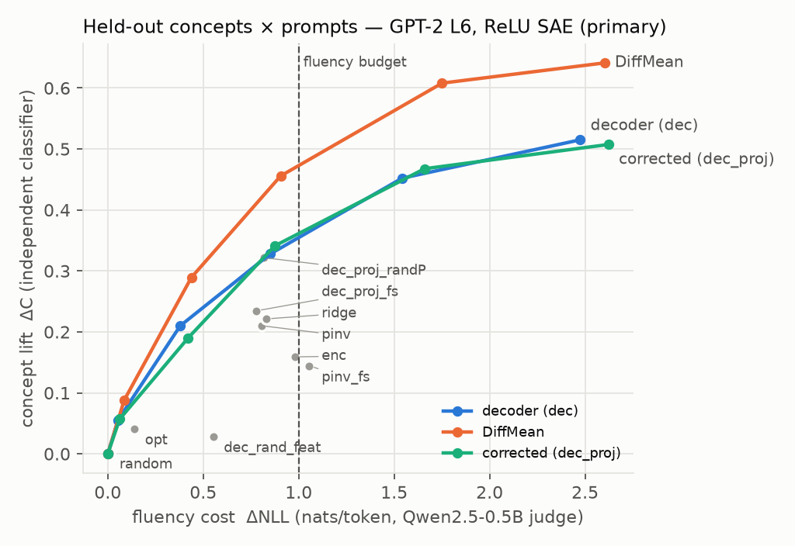
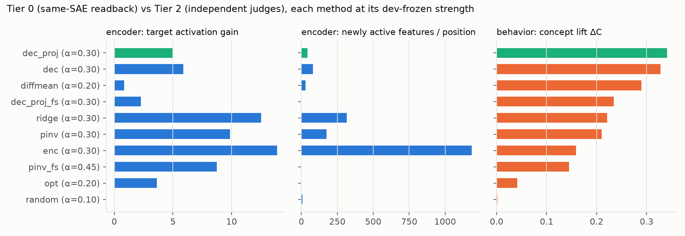
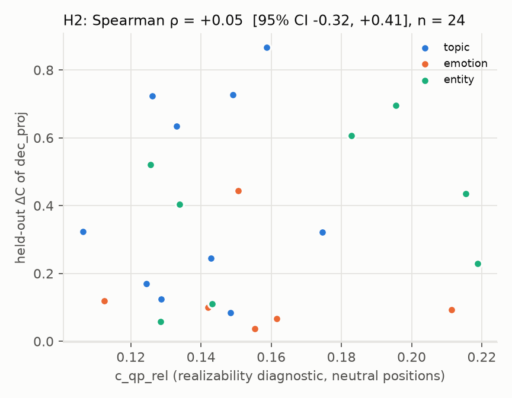
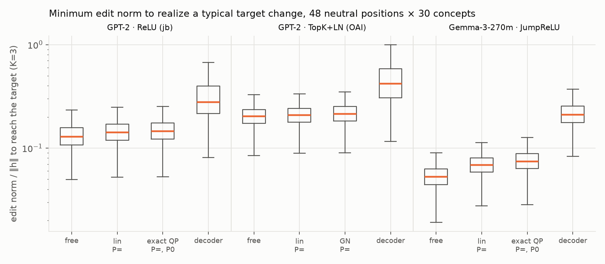

# N3 report: Which SAE feature edits are realizable? Geometry, interference, and constrained steering

*Status: **NO_GO***

- H1 was decided on held-out data under the pre-registered rule (freeze commit `4282fb5`), and H2 is
  not supported.
- The H1 decision (primary contrasts and guards) was independently re-verified from the raw files.
- H2, TopK, the secondary analyses and the controls were recomputed by `scripts/15_report_numbers.py`
  (`results/analysis/report_numbers.json`). They were also audited for consistency with the text, but
  not independently re-derived.

## 0. Verdict (pre-registered decision)

**NO_GO.** The pre-registered corrected edit is `dec_proj`, a first-order projection that holds the
*active* protected features fixed; it still switches on ~44 new features per position.

- It is **not shown to improve** independent behavior over plain decoder steering.
- With the primary jb ReLU SAE, it is **not shown to beat** the generic DiffMean baseline.
- Arms that enforce more of the exact finite-step definition (`dec_proj_fs`, `pinv_fs`, `opt`) and the
  encoder-side arms (`enc`, `pinv`, `ridge`) steer *worse* than `dec` (exploratory).
- The improvements are confined to SAE-internal readouts. This is the brief's NO_GO pattern:
  "같은 encoder 점수만 좋아지거나 generic baseline과 같으면 NO_GO".

1. **Q1: can T change while P is preserved? At the SAE's own readout, yes, cheaply, with one structural
   exception.** (`docs/03_realizability.md`)
   - For ReLU and JumpReLU SAEs, the exact finite-step QP realizes a typical target change with every
     active feature preserved and every inactive feature kept off, at **4–14% of ‖h‖**.
   - It is verified feasible for **100%** of ReLU requests and **97.5% / 95.5%** of JumpReLU requests
     (K = 1 / K = 3). The rest are undetermined at float32 tolerance and counted as not feasible.
   - Interference (κ) inflates the cost by 7–29%.
   - Local Jacobian/pseudoinverse solutions are not finite-step valid: they flip 9–74 gates, and the
     first flip occurs 3–11% of the way along the step. The exact correction adds only 1–8% norm.
   - Under TopK+LN, full P preservation is structurally impossible in >99% of requests. The target
     starts inactive and the k slots are full, so one protected feature must be evicted.
2. **Q2: does diagnosing or correcting realizability help downstream behavior? Not shown.** This is
   the minimal decisive experiment: GPT-2 small, jb ReLU SAE, 16 held-out concepts × 48 held-out
   prompts.
   - `dec_proj` removes all protected-feature change and 45% of spurious activations *inside the SAE*.
   - Behaviorally it is not distinguishable from `dec`: ΔC +0.013, CI [−0.033, +0.058], p = 0.37.
   - It is not distinguishable from DiffMean at the frozen operating points: +0.052, p = 0.32.
   - A count-matched *random* protected set is not distinguishable in ΔC: +0.019, p = 0.16.
   - At matched norm (secondary A4, uncorrected), DiffMean is nominally ahead: −0.115, p = 0.032;
     Holm-adjusted over the 4 comparators, 0.064.
     - At that norm DiffMean was over the dev fluency budget and costs more utility (ΔCE +0.11,
       p = 0.002).
   - At matched fluency (post hoc), DiffMean lies above both SAE curves.
   - The ΔC null replicates on **one** held-out TopK SAE at the same hook: `dec_proj` − `dec` = −0.010,
     p = 0.34. This is a weak test:
     - the correction barely changes Tier 0 there (protected change 0.20 → 0.17);
     - only the decision arms and controls were transferred;
     - with that SAE the decoder arms *beat* DiffMean under the rule (see §6).
3. **H2: the realizability diagnostic shows no detectable association with steerability.**
   - Exact QP cost vs held-out ΔC over 24 concepts: ρ = +0.05, CI [−0.32, +0.41]. A moderate positive
     association is not excluded.
   - The highest point estimate among the predictors is the concept's generic DiffMean ΔC
     (ρ = +0.51). That comparison was not tested, and it shares the judge and prompts with the outcome.

**What remains positive, and what is only suggested.**
- The selected concept features' decoder directions steer the judged concept. `dec` beats a random
  decoder row by +0.30 ΔC (ReLU) and +0.39 (TopK). The control is one random feature (K = 1),
  compared with K = 3 for `dec`.
- The exact finite-step analysis cleanly separates "realizable inside the SAE" from "moves behavior".
  This is *consistent with* the behavioral bottleneck lying outside the SAE's same-layer encoder
  geometry. That was **not tested**: no mediation, error-channel or restore-T reversal analysis was
  run (audit N15).
- Per the brief ("거대 SAE 재학습은 핵심 가설을 확인하기 전에 시작하지 마라"), no SAE retraining is warranted.

**Scorecard against the literature audit's NO_GO risks (`docs/01_literature_audit.md` §10).**

| risk | status |
|---|---|
| N1, parity with DiffMean | fails |
| N2, gains only in Tier 0 | met in spirit: gains in Tier 0 plus a small Tier-1 effect; none in Tier 2 |
| N3, selection confound | controlled: same T for every SAE arm |
| N5, pinv/ridge repeat SAE-TS | yes; pinv and ridge fall below dec |
| N6, preservation stays local | yes: the layer-8 drift reduction is small |
| N7, diagnosis adds nothing | fails (H2) |
| N8, no transfer across SAE settings | the ΔC null transfers; the DiffMean relation does not |
| N9, tuning artifact | no: frozen points, no per-concept tuning |
| N11, loss of instruct/fluency/utility | not better than dec |
| N12, collateral vs random | n/a (no gain) |
| N14, runtime without payoff | yes: 65–1,800× cost, no Tier-2 gain |
| N4, N10, N13, N15 | not run (N13: infeasibility is not dominant, see Q1) |

## 1. What was done (mapping to the brief)

| brief step | where |
|---|---|
| 1. AxBench, 2026 SAE-steering follow-ups, geometric-recovery / causal-validation audits | `docs/01_literature_audit.md`: 79 papers verified on primary pages, plus a completeness critic; prior-work relation in §10 below |
| 2. Pin model / SAE hooks, normalization, checkpoints | `configs/pinned.json`, `results/validation/*.json` (§2) |
| 3. Decoder, encoder-gradient, Jacobian pinv/ridge, direct activation optimization; norm-matched | `src/n3/methods.py` (§3) |
| 4. Finite-step realizability of T with P preserved, without claiming rank limits as a theorem | `docs/03_realizability.md` |
| 5. ReLU / JumpReLU / TopK active-set changes and non-differentiability; no global claims from Taylor | `docs/03_realizability.md`, `src/n3/realizability.py` |
| 6. Features and thresholds fixed on dev; evaluated on held-out prompts, concepts and another SAE setting | `docs/02_protocol.md`, `configs/protocol.json` (§5, §6) |
| 7. Encoder self-consistency kept separate from independent behavior; target, collateral, utility and runtime measured | §4–§8 |
| 8. Minimal decisive single-model experiment first | GPT-2 small L6 + jb ReLU SAE (§5) |

## 2. Fixed infrastructure

- **Model.** GPT-2 small (HF `openai-community/gpt2` @ `607a30d`).
  - The edit site is the output of block 5, which equals TransformerLens `blocks.6.hook_resid_pre`.
  - The stream is mean-centred, which equals TL `center_writing_weights`.
  - Checked against TransformerLens:
    - residual relative diff 1e-6;
    - identical active sets;
    - edited-logit KL ≈ 1e-8 for h-independent and h-dependent edits;
    - identical greedy generations through the KV cache (`results/validation/hf_vs_tl_gpt2_backend.json`).
- **SAEs (encoders re-implemented and checked against SAELens bit for bit).**

  | setting | SAE | FVU | L0 | CE recovered |
  |---|---|---|---|---|
  | primary | jbloom `gpt2-small-res-jb` L6 (ReLU, 24,576) | 0.126 | 51 | 98.4% |
  | held-out SAE, same site | OpenAI v5 32k TopK (k = 32, LayerNorm input) | 0.133 | 32 | 98.8% |
  | realizability only | Gemma Scope 2 L12 16k JumpReLU on Gemma-3-270m | 0.124 | 67 (published 60) | 99.1% |

  - For Gemma-3-270m the ungated mirror `unsloth/gemma-3-270m` was used. The SAE reconstruction
    confirms its weights.
- **Mean invariance (found by the adversarial code review).**
  - Every W_enc column of the jb SAE has a large component (median 73% of its norm) along the
    all-ones direction. GPT-2 ignores that direction: every read of the residual goes through a
    LayerNorm.
  - Uncorrected, the encoder-side methods satisfied their constraints "through" that invisible
    direction.
  - All SAEs on GPT-2 therefore read `h − mean(h)`, their Jacobians are centred, and every edit is
    projected onto 1⊥ before norm matching.
  - The pre-fix runs are archived as invalid (`results/runs_invalid/`). This is recorded in
    `configs/pinned.json`.
- **Judges.** All are independent of GPT-2 and of every SAE (`results/validation/judge_validation.json`).
  - Concept judges: Yahoo-topic BERT (acc 0.73), emotion DistilBERT (0.92), DBpedia BERT (0.995).
  - Zero-shot NLI judge: DeBERTa-v3.
  - Fluency judge: Qwen2.5-0.5B.
  - Relevance judge: MiniLM.

## 3. Methods (all norm-matched per position, ‖δ‖ = α·median‖h‖, BOS never edited)

| family | method | what it does |
|---|---|---|
| SAE, uncorrected | `dec` | concept-feature decoder direction |
| | `enc` | encoder gradient of the target pre-activations |
| SAE, realizability-corrected | `pinv` | min-norm edit that moves pre_T while holding every active protected pre-activation (P=, first order) |
| | `ridge` | Tikhonov between `enc` and `pinv` |
| | `dec_proj` | decoder direction projected onto the null space of the active protected rows (P= only) |
| | `*_fs` | approximate finite-step correction: features that would switch on are added as constraints, ≤3 rounds of constraint generation. This is not the exact QP of `docs/03`, which was used only for the Tier-0 analysis |
| | `opt` | projected-gradient activation optimization with the full encoder: 20 steps; P= by projection, P0 by a hinge penalty |
| generic | `diffmean` | mean difference of concept vs. other-concept residuals |
| | `random` | fixed random direction |
| controls | `dec_rand_feat` | decoder row of a random feature (K = 1) |
| | `dec_proj_randP` | same projection, onto a count-matched random protected set |
| reference | `prompt` | concept cue in the prompt; not an activation edit |

## 4. Development findings (dev concepts × dev prompts only)

Data: 8 dev concepts × 24 dev prompts, 8 SAE methods × K ∈ {1, 3} and 2 generic methods, over
α ∈ {0.1, 0.2, 0.3, 0.45, 0.65}. That is 720 steered conditions plus 2 unsteered baselines, and
17,328 judged continuations (`results/analysis/dev2/`).

**(a) Matched norm, α = 0.30, K = 3.** Tier 0 is the same-SAE readback. The ms/pos column is from the
dev run on a busy CPU and is not comparable with §8.

| method | ΔC (Tier 2) | ΔNLL | ΔCE (OWT) | target gain (Tier 0) | ‖Δf_P‖/‖f_P‖ (Tier 0) | new features/pos (Tier 0) | Δerror/‖δ‖ | ms/pos (dev run) |
|---|---|---|---|---|---|---|---|---|
| dec_proj | **0.365** | 0.65 | 0.35 | 4.9 | **0** | 38 | 0.72 | 1.9 |
| dec | 0.337 | 0.63 | 0.37 | 5.5 | 0.26 | 55 | 1.25 | 0.08 |
| dec_proj_fs | 0.260 | 0.53 | 0.27 | 2.7 | 0 | **0.006** | 0.81 | 9.8 |
| pinv | 0.219 | 0.74 | 0.33 | 9.9 | 0 | 192 | 2.12 | 1.9 |
| ridge | 0.216 | 0.82 | 0.36 | 11.9 | 0.20 | 332 | 3.57 | 2.1 |
| enc | 0.195 | 0.95 | 0.41 | **12.8** | 0.78 | 1157 | **11.9** | 0.11 |
| (K = 1) diffmean | 0.441 | 1.04 | 0.41 | 1.0 | 0.28 | 57 | 1.26 | 0.01 |
| (K = 1) random | 0.005 | 0.49 | 0.16 | 0.0 | 0.23 | 40 | 1.10 | 0.01 |

**(b) Encoder self-consistency vs behavior (dev).**
- Across SAE methods, K and concepts, the Spearman correlation between Tier-0 target gain and Tier-2
  ΔC is computed within each α:
  - +0.18 at α = 0.1 (p = 0.04);
  - −0.10 at each α ≥ 0.2 (n = 128 cells from 8 concepts; none significant).
- On held-out data it is −0.10 at α = 0.30 (n = 96) and +0.14 to +0.36 at the other α (n = 32–48).
- The methods that raise the SAE's own target score most per unit norm (enc, ridge, pinv) steer
  behavior worse than dec/dec_proj. The constraint-enforcing `opt` and `pinv_fs` are lower still.
- Encoder-side edits push the residual furthest off the SAE's manifold: error-channel change 2–12× the
  edit norm, against 0.7× for `dec_proj`.
- On dev, ρ(spurious new activations, ΔNLL) = +0.34, +0.60 and +0.66 at α = 0.3, 0.45 and 0.65. At
  α = 0.1 and 0.2 it is −0.18 and +0.03. This does not replicate on held-out data (+0.07, +0.29, −0.35).

**(c) Budget-selected operating points** (ΔNLL ≤ 1.0, distinct-2 floor −0.10; frozen in
`configs/protocol.json`).
- dec_proj 0.365 > dec 0.337 > diffmean 0.307 > dec_proj_fs 0.260 > pinv 0.219 ≈ ridge 0.216 >
  enc 0.195 > pinv_fs 0.168 > opt 0.082 > random 0.017.
- `dec_proj` was pre-registered as the primary corrected method.
- Its dev lead over `dec` is small (+0.027): it is ahead on 6 of 8 concepts.

## 5. Held-out results: primary setting (the minimal decisive experiment)

16 held-out concepts in three families: five topics and three emotions never used in dev, plus the
entirely unseen entity family (amendment A1). There are 48 held-out prompts. Every arm runs at its
dev-frozen point with the same sampling noise per prompt. Files: `results/analysis/test1/`,
`results/logs_decide_test1.txt`.

**5.1 Pre-registered H1 decision: NO_GO.** Primary: `dec_proj`, K = 3, α = 0.30.

| dec_proj minus … | ΔC diff | two-way bootstrap 95% | exact sign-flip p (two-sided) | concepts > 0 | Holm |
|---|---|---|---|---|---|
| dec (K3, 0.30) | +0.013 | [−0.033, +0.058] | 0.37 | 11/16 | not rejected |
| diffmean (0.20) | +0.052 | [−0.056, +0.159] | 0.32 | 10/16 | not rejected |
| enc (K3, 0.30) | +0.182 | [+0.102, +0.269] | 1e-4 | 15/16 | rejected |
| random (0.10) | +0.339 | [+0.223, +0.461] | <1e-4 | 16/16 | rejected |

- **Guards:** all passed. The primary's ΔNLL is 0.875 ≤ 1.1. Degeneration and NLI concordance pass,
  and collateral is not worse than dec.
- **Why NO_GO:** the corrected edit is **not shown to be better** than plain decoder steering or than
  DiffMean. This is not "shown equivalent": the upper bound against `dec` is +0.058, about 18% of
  dec's lift.
- **Rule robustness:** NO_GO also holds under the original §6 rule of `docs/02_protocol.md`.
- **Independent reproduction, for the H1 decision arms only:** an adversarial verification workflow
  recomputed them from the raw generation and score files with independent code. Point estimates and
  p-values matched to 4 decimals, and bootstrap CIs to Monte Carlo error. Provenance, pairing and
  fingerprints were confirmed (`results/review/h1_adversarial_verification.json`). The controls,
  secondary and matched-fluency results were scored later and were not independently verified.

**5.2 Arm levels.** Concept-balanced means, each arm at its frozen point. The rows below the rule are
exploratory and not multiplicity-corrected.

| arm | ΔC | ΔNLL | ΔRel | protJS | ΔCE | layer-8 SAE drift (Tier 1) | ‖Δf_P‖/‖f_P‖ (Tier 0) | new feats/pos (Tier 0) | Δerror/‖δ‖ |
|---|---|---|---|---|---|---|---|---|---|
| dec_proj | 0.341 | 0.875 | −0.108 | 0.260 | 0.302 | 0.312 | **0.000** | 44 | 0.74 |
| dec | 0.328 | 0.851 | −0.110 | 0.271 | 0.315 | 0.343 | 0.306 | 80 | 1.97 |
| dec_proj_randP (control) | 0.322 | 0.819 | −0.109 | 0.268 | 0.307 | 0.337 | 0.304 | 83 | 1.94 |
| diffmean (α 0.2) | 0.289 | **0.438** | −0.075 | 0.247 | 0.169 | 0.244 | 0.180 | 28 | 1.06 |
| enc | 0.159 | 0.980 | −0.071 | 0.275 | 0.336 | 0.390 | 0.801 | 1186 | 13.9 |
| dec_rand_feat (control, K 1) | 0.028 | 0.554 | −0.046 | 0.251 | 0.207 | 0.321 | 0.283 | 64 | 1.93 |
| random (α 0.1) | 0.002 | 0.007 | −0.019 | 0.174 | 0.013 | 0.097 | 0.079 | 7 | 1.04 |
| prompt cue (reference) | 0.078 | 0.114 | −0.022 | 0.254 | 0 | 0 | – | – | – |
| *exploratory:* pinv | 0.210 | 0.804 | | | 0.306 | | 0.000 | 174 | |
| *exploratory:* ridge | 0.221 | 0.831 | | | 0.306 | | 0.218 | 316 | |
| *exploratory:* dec_proj_fs | 0.235 | 0.778 | | | 0.227 | | 0.000 | 0.008 | |
| *exploratory:* pinv_fs (α 0.45) | 0.144 | 1.055 | | | 0.358 | | 0.000 | 0.40 | |
| *exploratory:* opt (K1, α 0.2) | 0.041 | 0.141 | | | 0.056 | | 0.000 | 0.30 | |

Paired ΔC against `dec`, exploratory and uncorrected:

| arm | ΔC − dec | p | concepts above dec |
|---|---|---|---|
| dec_proj_fs | −0.093 | 0.004 | 3/16 |
| ridge | −0.107 | 0.014 | 3/16 |
| pinv | −0.118 | 0.009 | 2/16 |
| enc | −0.169 | 0.002 | 2/16 |
| pinv_fs | −0.183 | 0.002 | 4/16 |
| opt | −0.287 | 0.0002 | 2/16 |

All of these arms also lie below dec's held-out fluency curve. `opt` reached little of its target
(Tier-0 gain 3.6, against 5.9 for dec) and may be under-optimized at 20 steps.

**5.3 What the correction changes, tier by tier.** `dec_proj` minus `dec`, paired, 16 concepts.

- **Tier 0, the edited layer's SAE:**
  - protected-feature change: 0.31 → 0.000;
  - spurious new activations: 80 → 44;
  - error-channel disturbance: 1.97 → 0.74 of ‖δ‖.
- **Tier 1, layer-8 SAE on held-out OWT text:**
  - protected drift: 0.343 → 0.312 (−0.032, 16/16 concepts, p < 1e-4);
  - new activations: 52 → 36 per position (p = 4e-4).
  - The layer-8 reduction is small. For reference, even a random edit produces 0.097 layer-8 drift.
- **Tier 2, behavior:** no metric moves detectably.

  | metric | dec_proj − dec | p |
  |---|---|---|
  | ΔC | +0.013 | 0.37 |
  | NLI | +0.022 | 0.18 |
  | protected-attribute JS | −0.012 | 0.20 |
  | ΔRel | +0.002 | 0.72 |
  | ΔNLL | +0.024 | 0.48 |
  | ΔCE | −0.013 | 0.074 |

- **Specificity control:** replacing the active protected set with a count-matched *random* set of
  features is not distinguishable in ΔC (+0.019, CI [−0.028, +0.068], p = 0.16), nor in ΔNLL, protJS
  or ΔCE. Only the layer-8 SAE readouts differ: drift −0.026 and new activations −14.7 per position,
  0/16 concepts positive for each.

Improvements are therefore confined to SAE-internal readouts: fully at the edited layer (Tier 0), with
a small P-specific effect in the layer-8 SAE (Tier 1). No behavioral (Tier 2) metric moves detectably;
the upper 95% bound against `dec` is +0.058. NO_GO follows from the pre-registered H1 rule and from
parity with DiffMean and with the random-P control, both parts of the brief's rule.

**5.4 Against the generic baseline (secondary and exploratory, not part of the rule).**

- **Norm-matched (pre-registered secondary A4; every comparator at α = 0.30).**
  - `dec_proj` − `diffmean`: ΔC −0.115 [−0.223, −0.013], uncorrected p = 0.032; Holm-adjusted over the
    4 comparators, 0.064.
  - The ΔNLL difference is −0.03.
  - At this norm DiffMean has significantly higher ΔCE (0.413 vs 0.302; difference −0.111, p = 0.002),
    and it exceeded the dev fluency budget (dev ΔNLL 1.04 > 1.0). That is why α = 0.2 was frozen for it.
  - Against the other comparators at α = 0.30: dec +0.013 (p = 0.37), enc +0.182 (1e-4),
    random +0.339 (<1e-4).
- **At the frozen points.**
  - `dec_proj` costs more fluency than DiffMean: ΔNLL +0.44 (p = 0.0002, 15/16). It also costs more ΔCE
    (+0.13) and more layer-8 drift (+0.07, 16/16).
  - Its lift is not significantly higher.
  - Its small ΔC edge comes almost entirely from the entity family (+0.096). Without that family it is
    +0.007.
  - Post hoc penalized scores ΔC − λ·ΔNLL, with λ chosen after seeing the data (`report_numbers.json`,
    `posthoc_penalized_*`):

    | λ (per nat) | dec_proj − diffmean | p |
    |---|---|---|
    | 0.12 | −0.001 | 0.99 |
    | 0.25 | −0.057 | 0.25 |
    | 0.35 | −0.101 | 0.056 |
    | 0.46 | −0.149 | 0.011 |

- **Matched fluency, post hoc.** Held-out curves over α ∈ {0.1, 0.2, 0.3, 0.45, 0.65}, linear
  interpolation at a fixed ΔNLL, per-concept paired sign-flip tests.

  | ΔC at ΔNLL = | 0.25 | 0.5 | 1.0 |
  |---|---|---|---|
  | DiffMean | 0.18 | 0.31 | 0.47 |
  | dec | 0.15 | 0.24 | 0.35 |
  | dec_proj | 0.13 | 0.22 | 0.36 |

  - Per concept, `dec_proj` − `dec` is −0.014 (p = 0.21) at 0.5 nats and −0.000 (p = 0.97) at 1.0 nats.
  - `dec_proj` − DiffMean is −0.093 (p = 0.048) and −0.106 (p = 0.08).
  - Two points of context:
    - On dev, `dec_proj` and DiffMean were at parity at matched ΔNLL (+0.012, +0.011, +0.003;
      p ≥ 0.83).
    - From dev to held-out, the SAE arms' ΔNLL rose (dec_proj 0.65 → 0.875) while DiffMean's fell
      (0.49 → 0.44).

**5.5 Controls and references.**
- The concept features' decoder directions steer the judged concept: `dec` − `dec_rand_feat` = +0.30
  (p = 0.0005, 14/16).
  - The control is a single random feature (K = 1), against K = 3 for dec.
  - Feature selection works; the correction does not add to it.
- A prompt cue barely steers base GPT-2 small (ΔC +0.08). This may reflect that AxBench's models are
  instruction-tuned; it was not tested here.

## 6. Generalization: another SAE on the same site (TopK + LayerNorm)

- **Setup.** The held-out SAE is OpenAI v5 32k TopK (k = 32) with LayerNorm input, at the same residual
  site.
  - All dev-frozen hyper-parameters (K, α, methods) are transferred without re-tuning.
  - Feature selection re-applies the frozen rule to this SAE's statistics.
  - Same 16 held-out concepts × 48 held-out prompts.
  - After H1 was decided, the grid was reduced to the decision arms plus the two SAE-specific controls
    (`results/runs/topk1_NOTES.txt`).
  - The DiffMean and random generations are SAE-independent and are *shared* with §5.
  - Files: `results/analysis/topk1/`.

| arm (frozen point) | ΔC | ΔNLL | protJS | ΔCE | Tier 0: ‖Δf_P‖/‖f_P‖ | Tier 0: new feats/pos |
|---|---|---|---|---|---|---|
| dec_proj | 0.400 | 0.652 | 0.256 | 0.356 | 0.172 | 7.3 |
| dec | 0.410 | 0.625 | 0.280 | 0.369 | 0.200 | 6.6 |
| dec_proj_randP (control) | 0.413 | 0.630 | 0.272 | 0.362 | 0.198 | 6.7 |
| enc | 0.330 | 0.705 | 0.276 | 0.331 | 0.250 | 10.1 |
| diffmean (α 0.2; shared with §5) | 0.289 | 0.438 | 0.247 | 0.169 | 0.161 | 6.4 |
| dec_rand_feat (control) | 0.023 | 0.530 | 0.245 | 0.213 | 0.195 | 8.4 |
| random (α 0.1; shared with §5) | 0.002 | 0.007 | 0.174 | 0.013 | 0.085 | 2.7 |

| dec_proj minus … | ΔC diff | 95% CI | sign-flip p | concepts > 0 |
|---|---|---|---|---|
| dec | **−0.010** | [−0.047, +0.028] | 0.34 | 7/16 |
| dec_proj_randP | −0.013 | [−0.050, +0.023] | 0.051 | 4/16 |
| enc | +0.070 | [+0.001, +0.139] | 0.031 | 11/16 |
| diffmean | +0.111 | [+0.023, +0.198] | 0.015 | 10/16 |
| random | +0.398 | [+0.282, +0.511] | <1e-4 | 16/16 |

**Secondary contrasts, uncorrected.**

| metric | dec_proj − dec | p | dec_proj − dec_proj_randP | p |
|---|---|---|---|---|
| protJS | −0.023 [−0.049, −0.0001] | 0.009 | −0.016 | 0.125 |
| ΔCE | −0.013 | 6e-5 | −0.005 | 0.007 |
| KL | −0.014 | 3e-5 | −0.004 | 0.012 |
| ΔRel | +0.011 | 0.007 | | |

**Reading.**
- **The ΔC null replicates.** The correction does not improve the concept lift over plain decoder
  steering; the point estimate is slightly negative.
- **The correction is not distinguishable from a random protected set** on ΔC (p = 0.051, leaning
  against the correction) or on protJS (p = 0.125).
- **Small utility effects.** It gives small, uncorrected reductions in ΔCE and KL, about 4% of dec's
  ΔCE, partly specific against the random-P control. This is a small utility effect on this SAE, not a
  steering gain.
- **Even the Tier-0 benefit mostly disappears under TopK+LN.** Protected change drops only from 0.20 to
  0.17. This is consistent with the TopK slot conflict in `docs/03_realizability.md` and with LayerNorm
  coupling; the two were not separated. By construction of P, the slot conflict equals the share of
  positions where T starts inactive, 99.3–100%.
- **Against DiffMean, the relation reverses on this SAE.** Under the pre-registered rule, the decoder
  arms *beat* DiffMean (+0.111, p = 0.015, Holm-rejected, NLI-concordant), at higher ΔNLL and ΔCE.
  Interpolating the shared DiffMean curve, they are not behind DiffMean at matched ΔNLL (≈ 0.40 vs 0.36)
  and are roughly at parity at matched ΔCE. The DiffMean conclusion of §5 is therefore specific to the
  jb ReLU SAE. The gain over DiffMean here belongs to plain `dec` just as much; it is not due to the
  correction.
- **The rule's result on this setting is also NO_GO:** `dec` is not rejected.

## 7. H2: does the realizability diagnosis predict behavior?

- **Pre-registered test.** Primary diagnostic `c_qp_rel`: the exact finite-step QP cost of raising T by
  its typical activation while preserving P, over ‖h‖, median over 48 neutral positions. Outcome:
  held-out-prompt ΔC of `dec_proj` at its frozen point. n = 24 concepts: 8 dev + 16 held-out, all
  evaluated on the held-out prompts.
  - The protocol text (§6) originally named `dec` as the outcome method; `protocol.json` froze
    `dec_proj`. Under the `dec` outcome, ρ = +0.07. H2 is not supported either way.
- **Result: H2 is not supported.**

  | predictor | Spearman ρ with ΔC(dec_proj) | 95% bootstrap CI |
  |---|---|---|
  | **c_qp_rel (primary)** | **+0.05** | [−0.32, +0.41] |
  | c_lin_rel | +0.05 | [−0.31, +0.40] |
  | κ (interference inflation; degenerate, CV ≈ 0.02) | +0.19 | [−0.29, +0.60] |
  | c_dec_rel (decoder cost) | +0.15 | [−0.25, +0.50] |
  | decoder collateral ‖Δf_P‖/‖f_P‖ | +0.25 | [−0.15, +0.58] |
  | decoder spurious activations | +0.42 | [−0.02, +0.72] |
  | *baseline:* max decoder cosine (Khan et al.-style crowding) | −0.17 | [−0.51, +0.21] |
  | *baseline:* decoder neighbor density (cos > 0.3) | +0.13 | [−0.30, +0.55] |
  | *baseline:* log feature density | +0.34 | [−0.13, +0.71] |
  | *baseline:* encoder–decoder cosine | +0.18 | [−0.21, +0.50] |
  | *baseline:* DiffMean ΔC of the same concept | **+0.51** | [+0.11, +0.80] |

- **Reading.**
  - The SAE-internal cost of realizing a concept edit shows no detectable association with how well
    the concept can be steered behaviorally. A moderate positive association is not excluded by the
    CI.
  - The highest point estimate is the same concept's DiffMean ΔC. It was not tested against the other
    predictors, and it shares the judge and prompts with the outcome.
- Files: `results/analysis/h2_gpt2_relu_jb_L6.json`, `results/analysis/h2_table_gpt2_relu_jb_L6.csv`.

## 8. Cost

Measured on an idle CPU (4 threads) with `scripts/14_runtime.py`, each method at its frozen point
(`results/runtime/gpt2_relu_jb_L6.json`).

| method | edit cost, ms / position (n = 24) | edit cost, ms / position (n = 1024) | 24 prompts × 40 tokens generation, s (unsteered 4.39) |
|---|---|---|---|
| dec / diffmean / random / enc | 0.005–0.02 | 0.001–0.006 | 4.5–4.7 (+3–7%) |
| dec_proj / pinv / ridge | 0.53–0.57 | 0.65–0.77 | 5.43–5.48 (+24–25%) |
| dec_proj_fs / pinv_fs | 3.1–3.6 | 4.3–5.8 | 8.8–10.0 (+100–128%) |
| opt (20 steps, full encoder) | 14.4 | 10.8 | 20.2 (+360%) |

- At n = 24, the corrected methods cost about 65–1,800× more per edit than `dec` and 100–2,800× more
  than DiffMean. At n = 1024 the ratios are about 500–8,700×.
- In return they buy mainly SAE-internal improvements: a small layer-8 effect and, on TopK, small
  ΔCE/KL reductions. There is no ΔC gain.

## 9. Deviations, limitations, and what is *not* claimed

**Not claimed.**
- No new theorem. The rank and feasibility of the linear system are trivial here: full row rank in 100%
  of cases. The exact QP is textbook convex optimization, and exact reasoning over ReLU activation
  patterns is standard in verification (Reluplex, MIPVerify).
- No global guarantee from local (Jacobian) solutions. The finite-step results are exact, up to a 1e-3
  margin and solver tolerance, where the encoder is piecewise affine (ReLU/JumpReLU). The TopK+LN
  statements are first-order results checked with true forward passes.
- No confirmatory claim that realizability-aware editing *hurts*. Exploratorily (uncorrected), every
  arm that enforces more of (T, P=, P0) than `dec_proj` gives a lower ΔC than `dec` at its frozen point
  and lies below dec's held-out fluency curve. The exact QP of `docs/03` was not run as a steering arm.
- No claim that DiffMean is generally better than SAE steering. On the jb ReLU SAE it is ahead at
  matched norm and fluency (secondary / post hoc). On the TopK SAE the decoder arms beat it at the
  frozen points.

**Deviations from the brief and the literature protocol** (see also the addendum to
`docs/01_literature_audit.md`).
1. *Model scale and judge.* CPU only and no API keys, so AxBench itself could not be reproduced
   (Gemma-2-2B/9B-IT, GemmaScope, gpt-4o-mini judge). The decisive experiment uses GPT-2 small, a base
   model, with supervised classifier judges plus an NLI judge. Absolute concept scores are not
   comparable to AxBench numbers. The *design* follows AxBench (factor selection on dev, held-out
   evaluation).
2. *Extended arms not run:* SAE-TS, FGAA, COAST, S&P, RePS/HyperSteer, and the Err(h)-clamping arm.
   The critic had listed Err-clamping in the minimal decisive set. The arm set that was run is dec,
   enc, pinv, ridge, dec_proj, approximate finite-step (`*_fs`), opt, DiffMean, random, prompting, and
   the two controls.
3. *Single sample per prompt* (48 prompts × 16 concepts per arm), with common random numbers across
   arms.
4. *Concept texts vs judges.* The concept texts used for feature selection and DiffMean come from the
   training splits of the same datasets the classifier judges were trained on. This is why NLI
   concordance was required; the NLI judge agrees in direction and significance.
5. *Held-out SAE setting.* The TopK+LN SAE sits at the same site in the same model. The Gemma-3-270m
   JumpReLU setting was used for realizability only. Its behavioral run was pre-registered as
   conditional on GO and was therefore not run.
6. *Mid-course fixes, all before any held-out run.*
   - The all-ones-direction centring fix (dev1 invalidated).
   - α = 0.9 dropped from dev.
   - Amendments A1–A5 (A6, the H2 outcome switch made at freeze, is recorded after the fact).
   - The fluency-guard change.
   - All are listed in `docs/02_protocol.md`. After H1 was decided, the TopK transfer grid was reduced
     to the decision arms plus controls.
7. *Scoring order.* The NLI judge was run only for the rows needed by the decision rule, to save
   compute. The scoring order was prioritized: decision arms, then controls, then norm-matched points,
   then the others.
8. *Statistics.* H1 uses 16 held-out concepts. With an exact sign-flip test and Holm correction over 4
   comparators, a real but small advantage (e.g. +0.02 ΔC over dec) could be missed. The bootstrap CI
   against dec ([−0.033, +0.058]) bounds how large such an advantage could plausibly be.
9. *Audit requirements not executed* (compute or scope):
   - SAE-A, output-score and Delta-Token-Confidence feature selection (P3).
   - CE/KL-matched comparisons (P4). The primary H1 compares each arm at its own frozen point; the
     norm-matched comparison is secondary.
   - A FISTA sparse-inference readout, raw-activation probes, Cause/Iso tasks, and MMLU-type utility
     (P7).
   - A frozen/random-decoder SAE, a randomized model, a placebo target, and seed variance (P8).
   - Stress strata and a |P| sweep (P9).
   - Persistence measured during generation (P10); the layer-8 readout is on OWT text.
   - A power analysis and a human/programmatic judge audit (P11).
   - Toy oracle validation (P12).
   - The N15 mediation/reversal test.
   - No behavioral readout of the *specific* protected features P was available. Behavioral collateral
     was proxied by the cross-family judge shift (protJS) and by utility metrics.
10. *Provenance.*
    - `configs/splits.json` with A1 was committed after the H1 decision (116509e after bf77d16). The
      seeded function that generates it was committed before the freeze and reproduces it exactly.
    - The scoring command was changed after generation (`--nli` → `--nli-decision-arms` plus a priority
      order), and the first scoring log was overwritten. This does not affect the decision arms.
    - `protocol.json` records `frozen_at_commit = fb23c60`, the parent of the freeze commit, with the
      same code fingerprint.
    - `docs/02_protocol.md` disclosures (i)–(iv) and A6 (the H2 outcome method).

## 10. Relation to prior work (see `docs/01_literature_audit.md`)

- **DiffMean vs SAE steering.** The observation that DiffMean is competitive with or better than SAE
  steering replicates AxBench [1] in a small base model, but only for the jb ReLU SAE; the TopK SAE
  differs.
- **Pseudoinverse steering.** The failure of pseudoinverse-type SAE-target edits (`pinv`, `ridge`)
  echoes SAE-TS's pseudoinverse result [11], here with a local Jacobian rather than a learned effect
  matrix.
- **Preserved features vs preserved behavior.** The dissociation between preserving SAE features and
  preserving or controlling behavior is in line with Cui et al. [14] and with the error-channel
  findings [44].
- **Downstream attenuation.** The small layer-8 persistence of layer-6 preservation is consistent with
  downstream correction [18].
- **Null-space construction.** `dec_proj`'s construction follows AlphaEdit (arXiv:2410.02355) and
  AlphaSteer [20].
- **Sanity controls.** Critic-found 2026 work reports SAE steering indistinguishable from random
  perturbation in some settings (arXiv:2603.18353), and no method consistently beating prompting
  (MAxBench, arXiv:2609.13072). Our random-row controls clearly separate from the concept features
  (+0.30), so that stronger failure mode is *not* reproduced here.
- **Weak random controls.** da Silva & Heimersheim (arXiv:2606.24964) report activation plateaus
  under which an isotropic, norm-matched random direction is a weak control by construction. The
  `random` comparator here is such a control. The specificity statements therefore rest on the
  random-decoder-row and random-protected-set controls, not on `random`.
- **What this work adds, within its scale.**
  - An exact finite-step (T, P=, P0) realizability analysis across three SAE architectures.
  - Pre-registered held-out tests, with specificity controls, in which this Tier-0 realizability and
    its first-order correction are not shown to translate into independent behavior.
